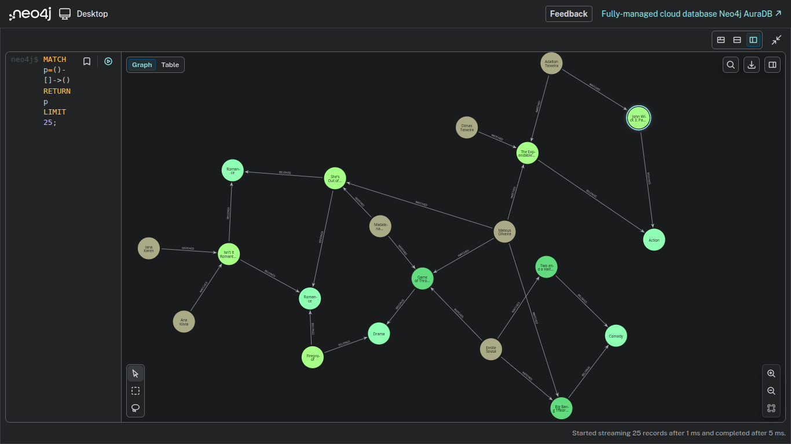
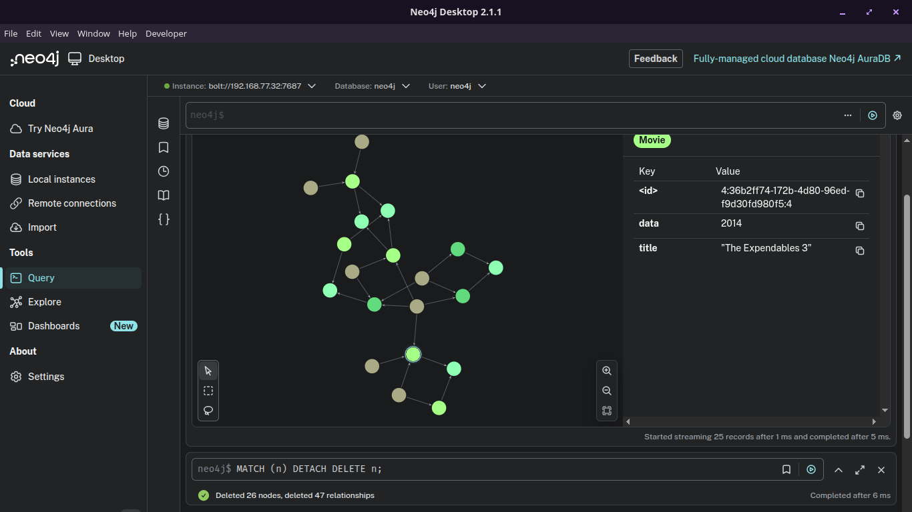
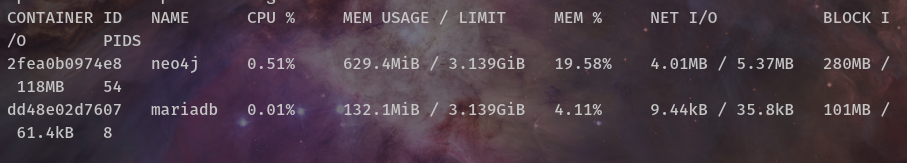
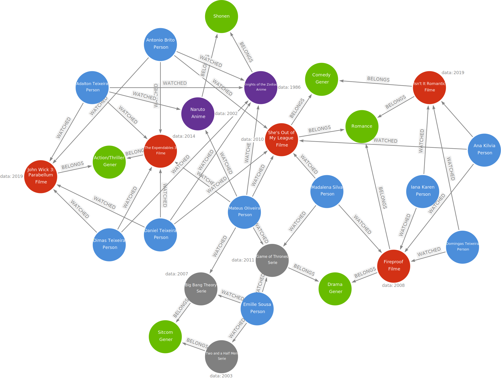

# 🎬 Graph de Consumo de Conteúdo (Neo4j)

Este projeto representa um **grafo de relacionamento entre pessoas e conteúdos audiovisuais**, modelado utilizando **Neo4j** e a linguagem **Cypher**.  
O objetivo do grafo é demonstrar como usuários consomem filmes, séries e animes, além de seus vínculos com gêneros.

---

## 🖼️ Visualizações do Grafo

Abaixo estão algumas imagens que ajudam a compreender a estrutura e o comportamento do grafo:

### 📌 1. Visualização Geral do Grafo
> Exibição completa do grafo no Neo4j Browser, mostrando pessoas, conteúdos e gêneros.



---

### 📌 2. Cluster de Usuários e Conteúdos
> Destaque para clusters formados por afinidade de consumo.



---

### 📌 3. Ambiente Neo4j / Infraestrutura
> Neo4j Desktop conectado ao banco rodando em Docker no Ubuntu Server.



---
### 📌 4. Criação de Graph Arrows.app / Criação 
> https://arrows.app/



## 🧠 Visão Geral do Grafo

O grafo é composto por quatro tipos principais de nós:

### 👤 Person
- `caption` → Nome da pessoa

### 🎥 Movie
- `title` → Título do filme
- `data` → Ano de lançamento

### 📺 Serie
- `title` → Título da série
- `data` → Ano de lançamento

### 🎌 Anime
- `data` → Ano de lançamento

### 🏷️ Gener
- `title` → Nome do gênero

---

## 🔗 Relacionamentos

### ▶️ WATCHED

- `date` → Data em que o conteúdo foi assistido

### 🧩 BELONGS

---

## 💻 Código Cypher

O código abaixo é responsável pela criação completa do grafo, incluindo nós, propriedades e relacionamentos.

### 📄 Arquivo

```cypher

CREATE
(`Dimas Teixeira`:Person {caption:"Dimas Teixeira"})
-[:WATCHED {date:"2018-05-20"}]->(`Knights of the Zodiac`:Anime {data:1986})
<-[:WATCHED {date:"2020-04-10"}]-(`Antonio Brito`:Person {caption:"Antonio Brito"})
-[:WATCHED {date:"2021-09-18"}]->(`John Wick 3: Parabellum`:Movie {title:"John Wick 3: Parabellum", data:2019})
<-[:WATCHED {date:"2021-07-22"}]-(`Dimas Teixeira`)
-[:WATCHED {date:"2016-09-25"}]->(`The Expendables 3`:Movie {title:"The Expendables 3", data:2014})
<-[:WATCHED {date:"2015-05-30"}]-(`Adalton Teixeira`:Person {caption:"Adalton Teixeira"})
-[:WATCHED {date:"2022-03-08"}]->(`John Wick 3: Parabellum`)
-[:BELONGS]->(:Gener {title:"Action"})
<-[:BELONGS]-(`The Expendables 3`)
<-[:WATCHED {date:"2017-02-20"}]-(`Mateus Oliveira`:Person {caption:"Mateus Oliveira"})
-[:WATCHED {date:"2013-04-15"}]->(`Big Bang Theory`:Serie {title:"Big Bang Theory", data:2007})
<-[:WATCHED {date:"2015-08-03"}]-(`Emille Sousa`:Person {caption:"Emille Sousa"})
-[:WATCHED {date:"2016-04-20"}]->(`Game of Thrones`:Serie {title:"Game of Thrones", data:2011})
<-[:WATCHED {date:"2016-11-08"}]-(`Mateus Oliveira`)
-[:WATCHED {date:"2012-09-05"}]->(`She's Out of My League`:Movie {title:"She's Out of My League", data:2010})
-[:BELONGS]->(Romance:Gener {title:"Romance"})
<-[:BELONGS]-(`Isn't It Romantic`:Movie {title:"Isn't It Romantic", data:2019})
<-[:WATCHED {date:"2020-02-14"}]-(`Iana Karen`:Person {caption:"Iana Karen"}),

(`Big Bang Theory`)
-[:BELONGS]->(:Gener {title:"Comedy"})
<-[:BELONGS]-(`Two and a Half Men`:Serie {title:"Two and a Half Men", data:2003}),

(`Ana Kilvia`:Person {caption:"Ana Kilvia"})
-[:WATCHED {date:"2020-01-25"}]->(`Isn't It Romantic`)
-[:BELONGS]->(:Gener {title:"Romance"})
<-[:BELONGS]-(`She's Out of My League`)
<-[:WATCHED {date:"2012-12-18"}]-(`Madalena Silva`:Person {caption:"Madalena Silva"})
-[:WATCHED {date:"2018-03-15"}]->(`Game of Thrones`)
-[:BELONGS]->(:Gener {title:"Drama"})
<-[:BELONGS]-(Fireproof:Movie {title:"Fireproof", data:2008})
-[:BELONGS]->(Romance),

(`Emille Sousa`)
-[:WATCHED {date:"2011-06-25"}]->(`Two and a Half Men`),

(`Iana Karen`)
-[:WATCHED {date:"2013-08-20"}]->(Fireproof)
<-[:WATCHED {date:"2012-10-30"}]-(`Madalena Silva`),

(`Daniel Teixeira`:Person {caption:"Daniel Teixeira"})
-[:WATCHED {date:"2017-03-14"}]->(`The Expendables 3`)
<-[:WATCHED {date:"2016-11-12"}]-(`Antonio Brito`)
-[:WATCHED {date:"2014-07-30"}]->(`She's Out of My League`)
<-[:WATCHED {date:"2014-07-30"}]-(`Daniel Teixeira`)
-[:WATCHED {date:"2022-08-15"}]->(`Knights of the Zodiac`)
<-[:WATCHED {date:"2021-11-30"}]-(`Adalton Teixeira`),

(`Adalton Teixeira`)
-[:WATCHED {date:"2009-07-10"}]->(Naruto:Anime {data:2002})
<-[:WATCHED {date:"2008-10-05"}]-(`Mateus Oliveira`)
-[:WATCHED {date:"2023-12-05"}]->(`Knights of the Zodiac`),

(`Daniel Teixeira`)
-[:WATCHED {date:"2020-12-01"}]->(`John Wick 3: Parabellum`),

(Naruto)
-[:BELONGS]->(:Gener {title:"Shonen"})
<-[:BELONGS]-(`Knights of the Zodiac`),

(`Domingas Teixeira`:Person {caption:"Domingas Teixeira"})
-[:WATCHED {date:"2010-11-05"}]->(Fireproof)
<-[:WATCHED {date:"2011-02-15"}]-(`Ana Kilvia`)
-[:WATCHED {date:"2014-04-10"}]->(`She's Out of My League`),

(`Domingas Teixeira`)
-[:WATCHED {date:"2021-03-20"}]->(`Isn't It Romantic`);

```
