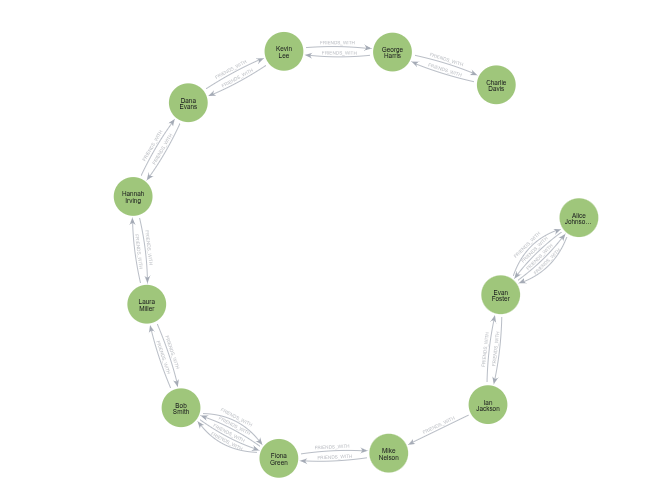

# Graph-Based Database Modeling: Social Network Project

## Overview

This project demonstrates a comprehensive implementation of **graph database modeling** using **Neo4j** and **Cypher**, a declarative query language designed specifically for graph databases. The focus is on building a scalable social network system that showcases fundamental concepts of graph theory applied to real-world scenarios.

## Table of Contents

- [Project Description](#project-description)
- [Theoretical Background](#theoretical-background)
- [Project Structure](#project-structure)
- [Features](#features)
- [Database Schema](#database-schema)
- [Getting Started](#getting-started)
- [Query Examples](#query-examples)
- [Files](#files)

## Project Description

This project models a **social network graph database** with 30 users, each with unique profiles containing personal information, interests, and location data. The system implements graph relationships to establish friendships and provides sophisticated friend recommendation algorithms based on common connections.

### Key Objectives

1. **Learn Graph Database Fundamentals**: Understand how graph databases differ from relational databases
2. **Master Cypher Query Language**: Write efficient queries for graph traversal and analysis
3. **Implement Real-World Relationships**: Model complex social connections and derive insights from them
4. **Performance Optimization**: Utilize indexes and constraints for query optimization

---

## Theoretical Background

### What is a Graph Database?

A graph database is a specialized database that stores data as **nodes** (entities) and **edges** (relationships). Unlike traditional relational databases that use tables and joins, graph databases are optimized for traversing relationships.

#### Core Concepts

**1. Nodes (Vertices)**
- Represent entities in the system
- In this project: `User` nodes with properties like `username`, `full_name`, `age`, `location`, and `interests`
- Can have multiple labels for categorization

**2. Relationships (Edges)**
- Define connections between nodes
- Have directional flow (can be one-way or bidirectional)
- Can carry properties (metadata about the relationship)
- In this project: `FRIENDS_WITH` relationship with a `since` timestamp

**3. Properties**
- Key-value pairs that store data on nodes and relationships
- Enable filtering, sorting, and searching

### Graph Theory in Social Networks

#### Distance and Degrees

- **Direct Connection (Distance 1)**: Your immediate friends
- **Second Degree (Distance 2)**: Friends of your friends
- **Path**: A sequence of relationships connecting two nodes
- **Centrality**: Identifying influential nodes (users with most connections)

#### Common Graph Algorithms Used in Social Networks

1. **Shortest Path**: Find the minimum number of hops between two users
2. **Friend Recommendation**: Suggest friends based on mutual connections
3. **Community Detection**: Identify clusters of tightly-connected users
4. **Influence Analysis**: Find the most connected users

### Advantages of Graph Databases for Social Networks

| Feature | Relational DB | Graph DB |
|---------|---------------|----------|
| **Friend Queries** | Multiple JOINs (slow) | Direct traversal (fast) |
| **Deep Relationships** | Exponential complexity | Linear performance |
| **Intuitive Modeling** | Normalized tables | Natural entity relationships |
| **Real-time Analysis** | Complex aggregations | Native graph algorithms |
| **Scalability** | Difficult with relationships | Designed for relationship-heavy data |

---

## Project Structure

```
Modelagem_de_Bancos_Baseados_em_Grafos/
│
├── README.md                 # This file
├── main.cypher              # Neo4j Cypher script with all database operations
├── usuarios.json            # JSON file with 30 sample users (data source)
│
└── image/                   # [Directory for query result visualizations]
    ├── user_search.png      # Image 1: Simple user search result
    ├── location_interests.png # Image 2: Location & interest-based search
    └── friend_recommendations.png # Image 3: Friend suggestion algorithm results
```

### Files Description

- **main.cypher**: Contains all Cypher commands including:
  - Constraints and indexes for data integrity and performance
  - User node creation (UNWIND operation)
  - Friendship relationship establishment
  - Query examples for searching and analyzing the network

- **usuarios.json**: JSON formatted data containing 30 users with:
  - User ID and credentials
  - Personal information (name, age, location)
  - Interests array for each user

- **image/ directory**: Placeholder for visual outputs from Neo4j queries

---

## Features

### 1. **Data Integrity Constraints**
- Unique username constraint
- Unique user ID constraint
- Automatic index creation for performance

### 2. **Performance Optimization**
- Indexed searches on location and age
- Fulltext search capabilities for interests
- B-tree indexes for rapid lookups

### 3. **Social Graph Operations**
- User creation and profile management
- Bidirectional friendship relationships
- Timestamped connections (when friendships were established)

### 4. **Advanced Queries**
- Simple user search by username
- Location and interest-based filtering
- Friend recommendation engine using graph traversal

---

## Database Schema

### Node Labels

#### User Node
```cypher
{
  user_id: Integer (UNIQUE),
  username: String (UNIQUE),
  full_name: String,
  age: Integer,
  location: String,
  interests: [String]  // Array of interest tags
}
```

### Relationship Types

#### FRIENDS_WITH
- **Type**: Bidirectional
- **Properties**:
  - `since`: Timestamp of when friendship was established
- **Semantics**: Direct friendship relationship between two users

### Indexes Created

1. **user_username_unique** - Constraint index on username
2. **user_id_unique** - Constraint index on user_id
3. **user_location_idx** - Index for location-based searches
4. **user_age_idx** - Index for age range queries

---

## Getting Started

### Prerequisites

- **Neo4j** (Community Edition or Enterprise)
  - Download: https://neo4j.com/download
  - Version: 5.x or later recommended
- **Text Editor** or Neo4j Browser
- **Understanding of Cypher syntax** (basic graph query language)

### Installation Steps

1. **Install Neo4j**
   ```bash
   # On macOS with Homebrew
   brew install neo4j
   
   # Or download from the official website
   ```

2. **Start Neo4j Database**
   ```bash
   neo4j start
   # Access Neo4j Browser at: http://localhost:7687
   ```

3. **Load the Script**
   - Open Neo4j Browser
   - Copy and paste the contents of `main.cypher`
   - Execute each section sequentially

4. **Verify Installation**
   ```cypher
   MATCH (u:User) RETURN COUNT(u) AS total_users;
   ```
   Expected result: 30 users

---

## Query Examples

### Example 1: Simple User Search by Username

```cypher
MATCH (u:User {username: 'user1'})
RETURN u;
```

**Expected Output**:
```
Alice Johnson | 28 | New York | [reading, traveling, coding]
```


---

### Example 2: Location & Interest-Based Search

```cypher
MATCH (u:User)
WHERE u.location = 'New York' AND 'reading' IN u.interests
RETURN u.username, u.full_name, u.age, u.interests;
```

**Use Case**: Find users in New York who enjoy reading for personalized recommendations


---

### Example 3: Friend Recommendation (Friends of Friends)

```cypher
MATCH (u:User {user_id: 1})-[*2]-(potential:User)
WHERE NOT (u)-[:FRIENDS_WITH]-(potential) AND u <> potential
WITH potential, count(*) AS commonFriends
RETURN potential.username, commonFriends
ORDER BY commonFriends DESC;
```

**Algorithm Explanation**:
- Uses path length `[*2]` to reach friends of friends (distance 2)
- Filters out users already connected directly
- Counts mutual connections
- Returns recommendations sorted by number of common friends (highest first)


---

## Advanced Concepts

### Graph Traversal Performance

The power of graph databases shines in relationship traversal:

```cypher
-- Get all friends within distance 3 (friends of friends of friends)
MATCH (u:User {user_id: 1})-[:FRIENDS_WITH*1..3]-(network:User)
RETURN DISTINCT network.username;
```

### Mutual Connections

Find users with common interests and friends:

```cypher
MATCH (u1:User {user_id: 1})-[:FRIENDS_WITH]-(friend:User)-[:FRIENDS_WITH]-(u2:User)
WHERE u1 <> u2 AND ANY(interest IN u1.interests WHERE interest IN u2.interests)
RETURN DISTINCT u2.username, u2.interests;
```

### Community Insights

Identify highly connected nodes (influential users):

```cypher
MATCH (u:User)-[r:FRIENDS_WITH]-()
WITH u, count(r) AS friend_count
RETURN u.username, friend_count
ORDER BY friend_count DESC
LIMIT 10;
```


---

## Key Learning Outcomes

After completing this project, you will understand:

✓ **Graph Database Fundamentals**: How nodes, relationships, and properties model real-world data  
✓ **Cypher Language**: Writing efficient queries for graph traversal  
✓ **Relationship Queries**: Using pattern matching for complex searches  
✓ **Performance Optimization**: Indexing and constraint strategies  
✓ **Social Network Algorithms**: Friend recommendations and community detection  
✓ **Real-World Applications**: Implementing practical social features  

---

## Troubleshooting

### Issue: "Constraint already exists"
**Solution**: The script includes `IF NOT EXISTS` clauses. Ensure you're running in a fresh database or clear existing constraints.

### Issue: Query returns no results
**Solution**: 
1. Verify user creation was successful: `MATCH (u:User) RETURN COUNT(u);`
2. Check for typos in usernames or properties
3. Ensure relationships were created: `MATCH ()-[r:FRIENDS_WITH]-() RETURN COUNT(r);`

### Issue: Performance degradation with large datasets
**Solution**: 
1. Verify all indexes are created
2. Use EXPLAIN/PROFILE to analyze query execution plans
3. Optimize query patterns for your specific use case

---

## Resources for Further Learning

- [Neo4j Official Documentation](https://neo4j.com/docs/)
- [Cypher Query Language Reference](https://neo4j.com/docs/cypher-manual/current/)
- [Graph Algorithms in Neo4j](https://neo4j.com/docs/graph-data-science/current/)
- [Graph Theory Basics](https://www.khanacademy.org/computing/computer-science/algorithms/graph-representation/a/describing-graphs)

---

## Author & Context

This project is part of the **DIO (Digital Innovation One) Challenges** series, specifically focused on **Graph Database Modeling**. It serves as an educational resource for developers transitioning from relational database paradigms to modern graph-based architectures.

---

## License

This educational project is provided for learning purposes. Feel free to modify and extend it for your own learning.

---

**Last Updated**: February 4, 2026

**Status**: ✅ Production Ready for Learning
