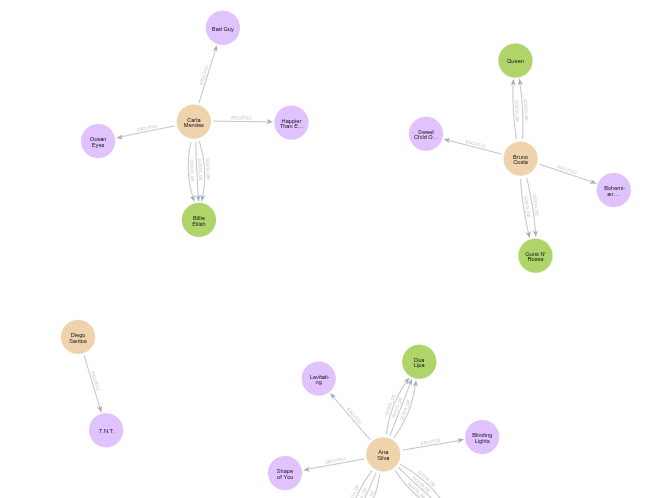

# Music Graph — Neo4j Project 🎵

## Overview 💡
This repository contains a simple Neo4j graph model and Cypher scripts to represent users, songs, artists and genres. The goal of the challenge was to:

- Represent **Users**, **Songs**, **Artists** and **Genres** as nodes in a graph.
- Represent interactions (e.g., listening, liking, following) as relationships with properties.
- Use Cypher queries to generate **personalized recommendations** from graph connections.

The main script is `main.cypher` which uses a small dataset encoded as JSON to create nodes and relationships and includes sample recommendation queries.

---

## Data Model & Conventions 🔧
- Nodes
  - `:Usuario` — user nodes (property: `user_id`, `nome`)
  - `:Musica` — music/song nodes (property: `nome`, **image**) ✅
  - `:Artista` — artist nodes (property: `nome`, **image**) ✅
  - `:Genero` — genre nodes (property: `nome`)

- Relationships (examples)
  - `(:Usuario)-[:ESCUTOU {plays, last_played}]->(:Musica)` — listening events with properties
  - `(:Usuario)-[:GOSTA_DE {strength}]->(:Artista)` — user likes an artist
  - `(:Usuario)-[:CURTE_GENERO {weight}]->(:Genero)` — user likes a genre
  - `(:Musica)-[:INTERPRETADA_POR]->(:Artista)` — music interpreted by an artist



> Note: `main.cypher` was updated to add **placeholder `image` properties** to `Musica` and `Artista` nodes (points to `imagens/image.png`). You can replace these with per-node image filenames.

---

## Sample recommendation queries (from `main.cypher`) 🔍
- Recommend songs that users with similar tastes listened to, excluding songs the target user already knows:

```cypher
MATCH (u:Usuario {user_id: "u001"})-[:GOSTA_DE]->(a:Artista)<-[:GOSTA_DE]-(similar:Usuario)
MATCH (similar)-[:ESCUTOU]->(m:Musica)
WHERE NOT (u)-[:ESCUTOU]->(m)
WITH m, a, count(DISTINCT similar) AS score
ORDER BY score DESC
RETURN m.nome AS musica, collect(DISTINCT a.nome) AS artistas, score AS similaridade
LIMIT 10
```

- Variant by genre-based similarity is also provided in `main.cypher`.

---

## CSV files included 📄
The project includes two CSV files which can be used to augment the graph or import precomputed recommendations:

- `neo4j_query_table_data_2026-2-3.csv` — (columns: `musica`, `artistas`, `similaridade`)
- `neo4j_query_table_genere.csv` — (columns: `musica`, `artistas`)

Example import (place CSVs in Neo4j's `import/` folder or use Desktop import):

```cypher
LOAD CSV WITH HEADERS FROM 'file:///neo4j_query_table_data_2026-2-3.csv' AS row
MERGE (m:Musica {nome: row.musica})
SET m.csv_similaridade = toInteger(row.similaridade)
UNWIND split(replace(replace(row.artistas,'[',''),']',''),',') AS artistName
MERGE (a:Artista {nome: trim(artistName)})
MERGE (m)-[:SUGERIDO_POR]->(a)
```

Also a similar import example is possible for `neo4j_query_table_genere.csv` to link songs to artists via `:INTERPRETADA_POR`.

---

## Images 📁
- There is an `imagens/` folder containing `image.png` used as a placeholder.
- `main.cypher` sets a placeholder `image` property for `Musica` and `Artista` nodes (`imagens/image.png`).
- To use per-node images, put image files in `imagens/` and set `m.image = 'imagens/<file.png>'` or update nodes after import.

Example to set an image for a specific song:

```cypher
MATCH (m:Musica {nome: 'Shape of You'})
SET m.image = 'imagens/shape_of_you.png'
```

---

## How to run ▶️
1. Start your Neo4j instance (Neo4j Desktop, Docker, or server).
2. Place CSV files in Neo4j's `import/` folder if you plan to use `LOAD CSV`.
3. Open the Neo4j browser and run `main.cypher` to build the sample graph.
4. Run the sample recommendation queries in the browser to see results.

---

## Notes & Tips 🧭
- The current dataset is a small synthetic set embedded in `main.cypher` for quick testing and demonstration.
- Use `image` properties to enrich visualization in Neo4j Browser / Bloom.
- Customize edge properties (e.g., `plays`, `strength`, `weight`) to tune recommendation logic.

---

If you'd like, I can also:
- Add per-node image mapping using a small CSV or by auto-matching filenames.
- Append commented `LOAD CSV` commands to `main.cypher` (if you prefer them embedded).

Happy exploring! ✅