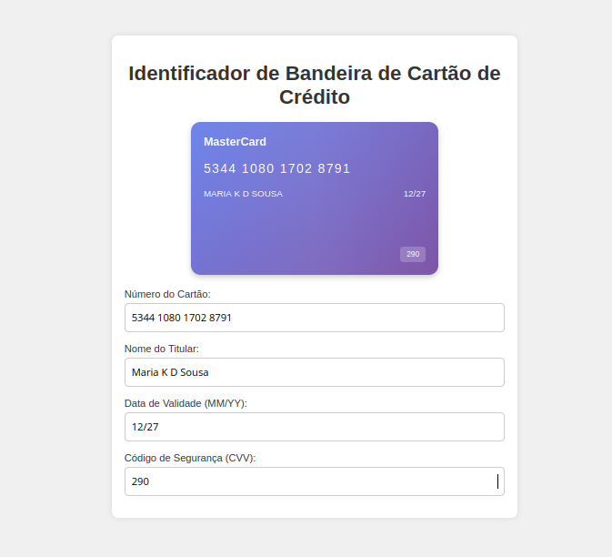

# Identificador de Bandeira de Cartão de Crédito

Este projeto é uma aplicação web simples que identifica a bandeira de um cartão de crédito (Visa, MasterCard, American Express, Discover) com base no número do cartão. Além disso, inclui um design visual que simula um cartão de crédito, com campos para número, nome do titular, código de segurança (CVV) e data de validade.

## Captura de Tela

## Funcionalidades

- **Identificação de Bandeira**: Detecta automaticamente a bandeira do cartão ao digitar o número.
- **Formatação Automática**: O número do cartão é formatado com espaços a cada 4 dígitos, e a data de validade com barra (/).
- **Visualização em Tempo Real**: O cartão simulado é atualizado em tempo real conforme você preenche os campos.
- **Interface Responsiva**: Design simples e responsivo usando HTML, CSS e JavaScript puro.

## Como Usar

1. Abra o arquivo `index.html` em um navegador web.
2. Digite o número do cartão no campo correspondente.
3. Observe a bandeira sendo identificada no cartão simulado.
4. Preencha os outros campos (nome, validade, CVV) para ver a atualização visual.

## Arquivos

- `index.html`: Estrutura da página web.
- `styles.css`: Estilos CSS para o design do cartão e formulário.
- `script.js`: Lógica JavaScript para identificação da bandeira e atualização do cartão.

## Tecnologias Utilizadas

- HTML5
- CSS3
- JavaScript (ES6+)

## Limitações

- A identificação de bandeira é baseada em padrões simples dos primeiros dígitos.
- Não valida se o número do cartão é válido (apenas identifica a bandeira).
- Não armazena ou processa dados reais de cartão (apenas para demonstração).